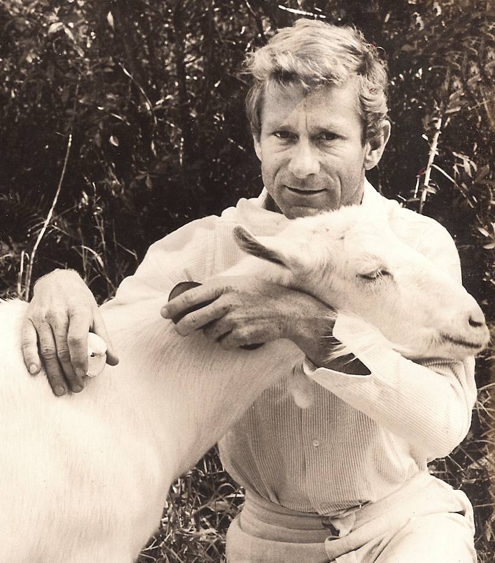
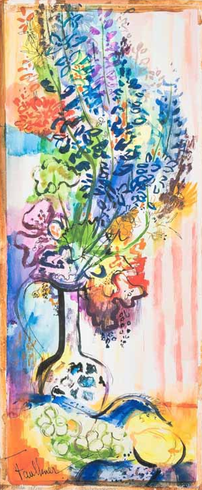
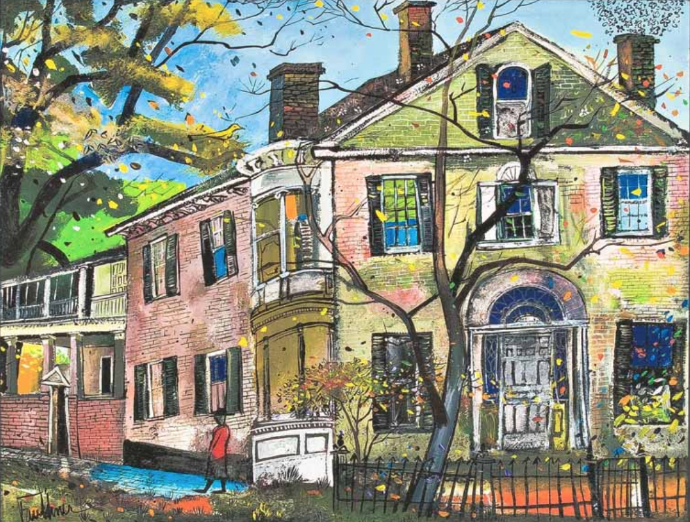
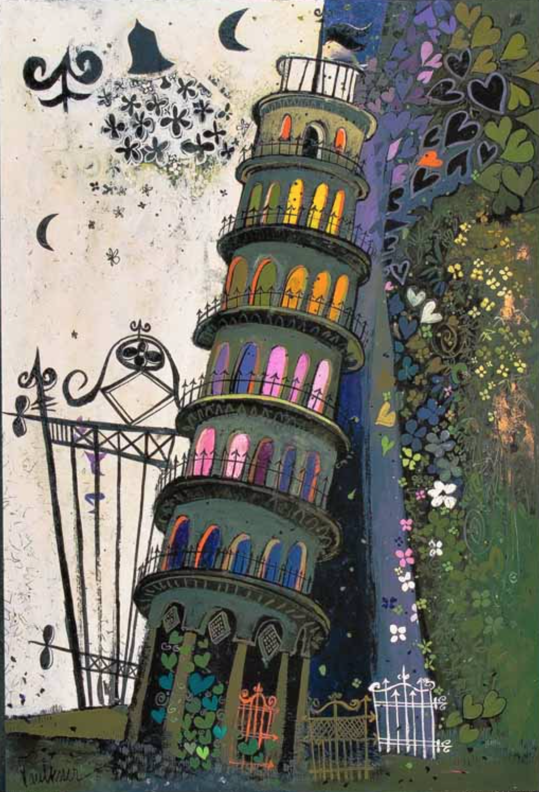

```{r, echo = FALSE}
library('faulkner')
library('knitr')

knitr::opts_chunk$set(
  fig.align = 'center', fig.path = 'inst/etc/', fig.height = 1.5
)
```

# Henry Lawrence Faulkner palettes

---



Henry and Alice

## Installation

```r
# install.packages('devtools')
devtools::install_github('raredd/faulkner')
```

Inspired by [Wes Anderson palettes](https://github.com/karthik/wesanderson)

```r
# install.packages('devtools')
devtools::install_github('karthik/wesanderson')
```

## Basic usage and available palettes

```{r, echo = FALSE}
knitr::kable(
  data.frame(
    '<code>names(faulkners)</code>' = names(faulkners),
    'No. of colors' = lengths(faulkners),
    row.names = NULL, check.names = FALSE
  )
)
```

```{r}
col <- faulkner('alice')
col

col <- faulkner('alice', type = 'continuous', z = 20)
col
```

## Palettes

```{r, include=FALSE}
faulkner <- function(...) {
  if (nargs() > 1L)
    faulkner::faulkner(...)
  else invisible(show_pal(faulkner::faulkner(...)))
}
```

### Alice hi on butterfly


```{r alice}
faulkner('alice')
```

### Butterfly


```{r butterfly}
faulkner('butterfly')
```

### Cats


```{r cats}
faulkner('cats')
```

### Delphiniums



```{r delphiniums}
faulkner('delphiniums1')
faulkner('delphiniums2')
```

```{r volcano, fig.height=6}
filled.contour(volcano, col = faulkner('delphiniums1', z = 21, type = 'c'))
```

### Dome


```{r dome}
faulkner('dome')
```

### Sicilian flowers


```{r flowers}
faulkner('flowers')
```

### Gated entrance


```{r gated}
faulkner('gated1')
faulkner('gated2')
```

### Giotto Campanelli


```{r giotto}
faulkner('giotto1')
faulkner('giotto2')
```

### Hunt-Morgan house



```{r huntmorgan}
faulkner('huntmorgan')
```

### Leaning tower



```{r leaning}
faulkner('leaning')
```

### New Orleans


```{r neworleans}
faulkner('neworleans')
```

## Extras

```{r extra}
show_pal(palette())
show_pal(rainbow(8))
```

### Generate a palette from an image

```{r imgpal}
go <- 'https://www.google.com/images/branding/googlelogo/2x/googlelogo_color_272x92dp.png'
ip <- imgpal(go)
ip <- show_pal(ip, n = 4)
ip

## google colors, https://www.schemecolor.com/google-logo-colors.php
go <- c('#4285F4', '#EA4335', '#FBBC05', '#34A853')
go <- show_pal(go)
go

## similarity between extracted and actual colors
rawr::rgbdiff(ip, go)
```
