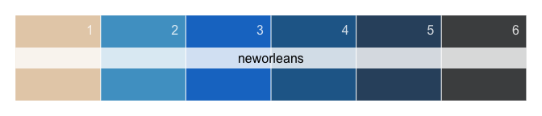

-   [Henry Lawrence Faulkner
    palettes](#henry-lawrence-faulkner-palettes)
    -   [Installation](#installation)
    -   [Basic usage and available
        palettes](#basic-usage-and-available-palettes)
    -   [Palettes](#palettes)
        -   [Alice hi on butterfly](#alice-hi-on-butterfly)
        -   [Butterfly](#butterfly)
        -   [Cats](#cats)
        -   [Delphiniums](#delphiniums)
        -   [Dome](#dome)
        -   [Sicilian flowers](#sicilian-flowers)
        -   [Gated entrance](#gated-entrance)
        -   [Giotto Campanelli](#giotto-campanelli)
        -   [Hunt-Morgan house](#hunt-morgan-house)
        -   [Leaning tower](#leaning-tower)
        -   [New Orleans](#new-orleans)
    -   [Extras](#extras)
        -   [Generate a palette from an
            image](#generate-a-palette-from-an-image)

# Henry Lawrence Faulkner palettes

------------------------------------------------------------------------


Henry and Alice

## Installation

``` r
# install.packages('devtools')
devtools::install_github('raredd/faulkner')
```

Inspired by [Wes Anderson
palettes](https://github.com/karthik/wesanderson)

``` r
# install.packages('devtools')
devtools::install_github('karthik/wesanderson')
```

## Basic usage and available palettes

| <code>names(faulkners)</code> | No. of colors |
|:------------------------------|--------------:|
| alice                         |             6 |
| butterfly                     |             6 |
| cats                          |             5 |
| delphiniums1                  |             6 |
| delphiniums2                  |             5 |
| dome                          |             6 |
| flowers                       |             5 |
| gated1                        |             5 |
| gated2                        |             5 |
| giotto1                       |             6 |
| giotto2                       |             6 |
| huntmorgan                    |             4 |
| leaning                       |             6 |
| neworleans                    |             6 |

``` r
col <- faulkner('alice')
col
```

    ## [1] "#4F524B" "#1FABD2" "#DFD6AA" "#D1B957" "#59AC43" "#8F70AC"

``` r
col <- faulkner('alice', type = 'continuous', z = 20)
col
```

    ##  [1] "#4F524B" "#42696E" "#358092" "#2998B5" "#29ADCF" "#5BB8C5" "#8EC3BA"
    ##  [8] "#C0CFB0" "#DDD2A1" "#D9CB8B" "#D6C375" "#D2BC5F" "#BEB653" "#9EB34E"
    ## [15] "#7EB049" "#5FAC44" "#649F59" "#728F74" "#807F90" "#8F70AC"

## Palettes

### Alice hi on butterfly


``` r
faulkner('alice')
```


### Butterfly


``` r
faulkner('butterfly')
```


### Cats


``` r
faulkner('cats')
```


### Delphiniums


``` r
faulkner('delphiniums1')
```


``` r
faulkner('delphiniums2')
```


``` r
filled.contour(volcano, col = faulkner('delphiniums1', z = 21, type = 'c'))
```


### Dome


``` r
faulkner('dome')
```


### Sicilian flowers


``` r
faulkner('flowers')
```


### Gated entrance


``` r
faulkner('gated1')
```


``` r
faulkner('gated2')
```


### Giotto Campanelli


``` r
faulkner('giotto1')
```


``` r
faulkner('giotto2')
```


### Hunt-Morgan house


``` r
faulkner('huntmorgan')
```


### Leaning tower


``` r
faulkner('leaning')
```


### New Orleans


``` r
faulkner('neworleans')
```



## Extras

``` r
show_pal(palette())
```


    ## [1] "black"   "#DF536B" "#61D04F" "#2297E6" "#28E2E5" "#CD0BBC" "#F5C710"
    ## [8] "gray62"

``` r
show_pal(rainbow(8))
```


    ## [1] "#FF0000" "#FFBF00" "#80FF00" "#00FF40" "#00FFFF" "#0040FF" "#8000FF"
    ## [8] "#FF00BF"

### Generate a palette from an image

``` r
go <- 'https://www.google.com/images/branding/googlelogo/2x/googlelogo_color_272x92dp.png'
ip <- imgpal(go)
ip <- show_pal(ip, n = 4)
```


``` r
ip
```

    ## [1] "#4285F4" "#EA4335" "#FBBC06" "#43A677"

``` r
## google colors, https://www.schemecolor.com/google-logo-colors.php
go <- c('#4285F4', '#EA4335', '#FBBC05', '#34A853')
go <- show_pal(go)
go
```

    ## [1] "#4285F4" "#EA4335" "#FBBC05" "#34A853"

``` r
## similarity between extracted and actual colors
rawr::rgbdiff(ip, go)
```


    ##       #4285F4, #4285F4 #EA4335, #EA4335 #FBBC06, #FBBC05 #43A677, #34A853
    ## red                  0                0        0.0000000        5.8823529
    ## green                0                0        0.0000000        0.7843137
    ## blue                 0                0        0.3921569       14.1176471
    ## rgb                  0                0        0.1307190        6.9281046
